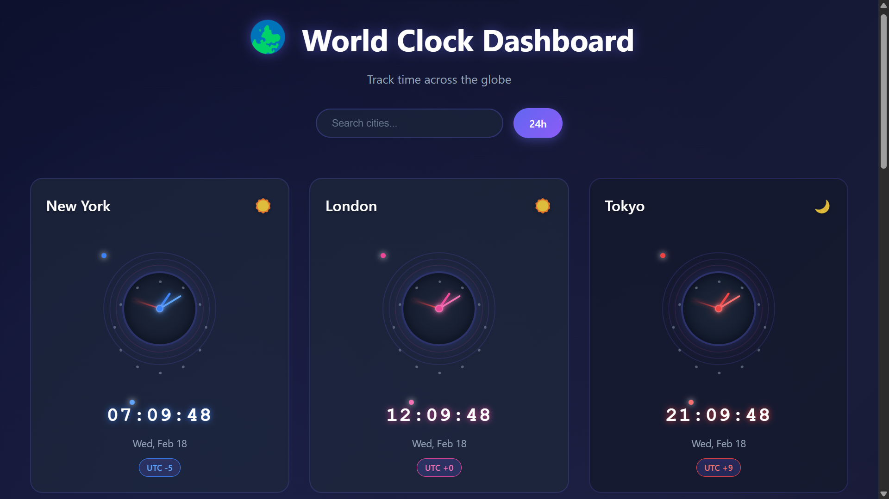
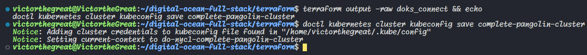
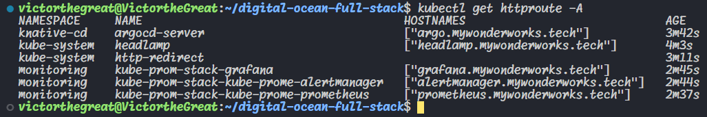
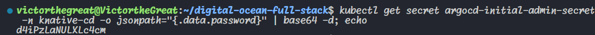
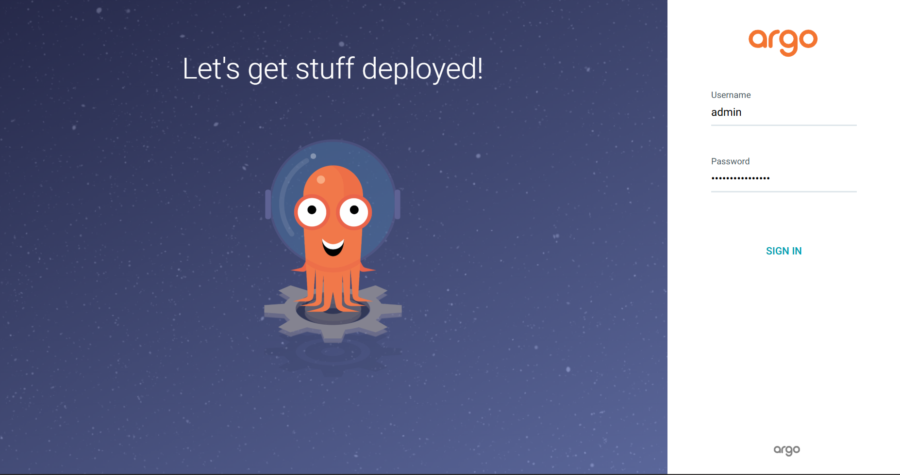
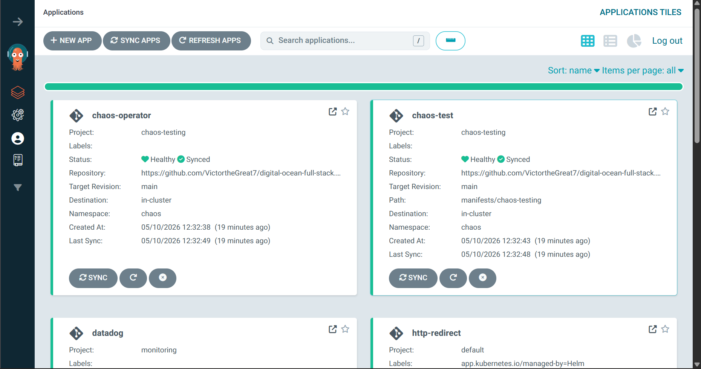
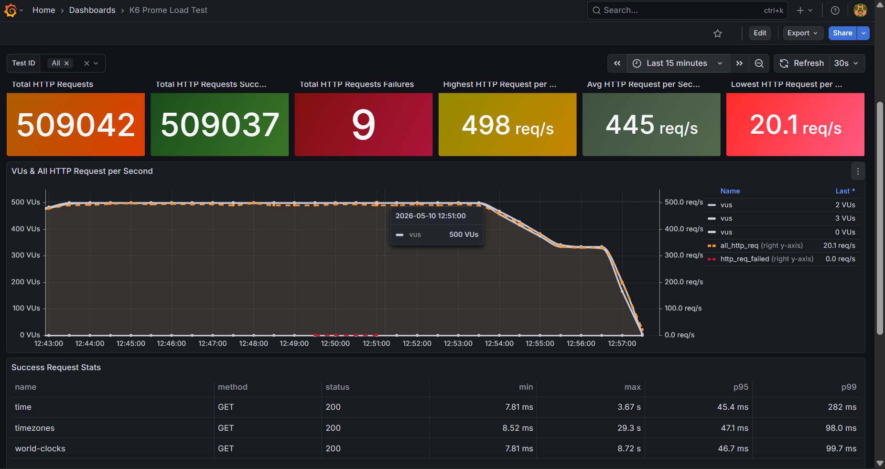
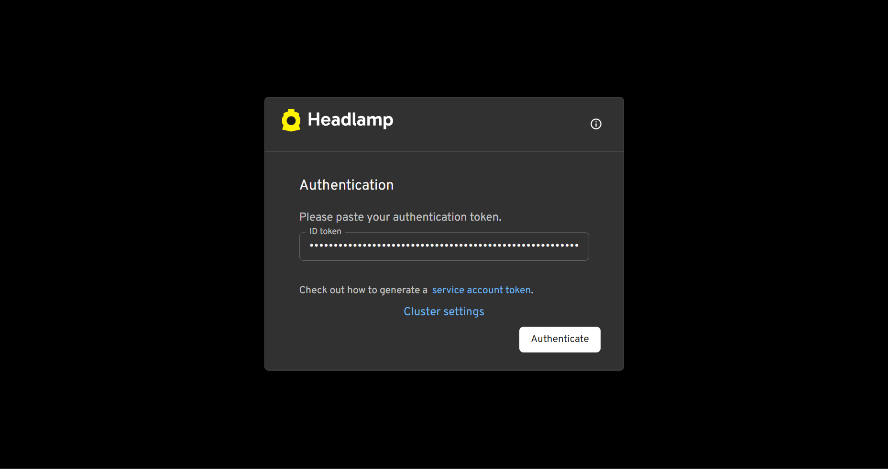
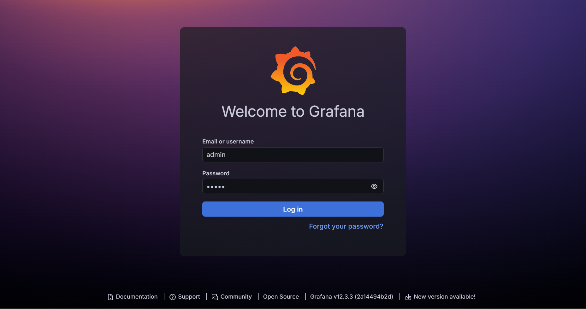
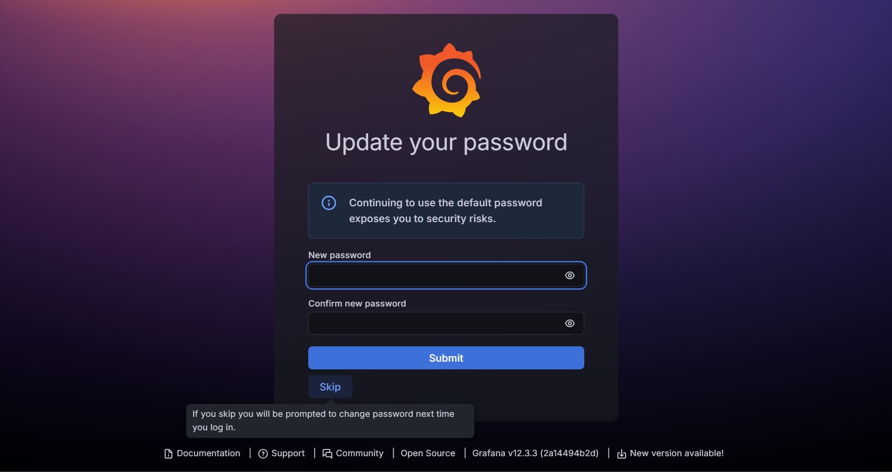

# Cloud Native Infrastructure Project

 

## 🚀 Project Overview: What Is This?

This project is a cloud-native infrastructure setup that can deploy applications to Digital Ocean Kubernetes Service (DOKS). It's an attempt at building an environment to host scalable and reliable applications in the cloud.

The app it's currently setup to host features a React frontend for displaying real-time world clocks and a Flask backend API for handling time zone data. The app pulls time zone info and displays it in a dashboard.



## 💡 Motivation: Why Did I Build This?

I created this project to "git gud" in cloud engineering and site reliability engineering (SRE) while building something practical. As someone looking to transition into DevOps or cloud roles, I wanted to simulate real-world scenarios: building a full-stack app from scratch, continuous integration, automating deployments, loadtesting and ensuring observability.

I'm trying to learn how tools fit together in a production-like environment, rather than just tinkering with them in isolation. This project is a sandbox for me to experiment with Kubernetes, Terraform, CI/CD pipelines, monitoring stacks, and security best practices—all while building something that has a tangible output (the world clock dashboard).

## 🛠️ Tech Stack: What Tools Am I Using and Why?

Here's a breakdown of the key technologies, grouped for clarity, with rationale for each choice:

| Category | Tools | Why? |
| ---------- | ------- | ------ |
| **Frontend** | React (with Vite), JavaScript | Sonnet decided that |
| **Backend** | Python, Flask | Sonnet also decided thaty |
| **Containerization** | Docker | Popular containerization tool |
| **Orchestration** | Kubernetes (DOKS), Helm, kubectl | I'm trying to build exertise here |
| **Infrastructure** | Terraform, Digital Ocean CLI | For Terraform, I have the most experience using HCL. For Digital Ocean, I had free credits (still stuck with a 3 droplet limit though) |
| **CI/CD** | GitHub Actions | It can help automate builds, tests, and deploys on every push/PR. It's free and built into where I keep my code |
| **Monitoring & Observability** | Prometheus, Grafana, Datadog, OpenTelemetry | Comprehensive metric, log, and trace collection using Datadog and the Kube-Prometheus stack to monitor SLIs and SLOs. Prometheus collects metrics efficiently; Grafana visualizes them in dashboards. Datadog is an all-in-one observability SaaS option I am testing |
| **Networking & Security** | Cilium Gateway, Cert Manager (Let's Encrypt), Digital Ocean Firewall, Cloudflare DNS | Cilium Gateway routes traffic securely; Cert Manager automates SSL for HTTPS. Firewall for cloud level security and Cloudflare for DNS |
| **Chaos & Load Testing** | Grafana's K6 | Automated API endpoint testing to identify system breaking points when under stress |

### ✨ Features

- **Infrastructure as Code:** Automated infrastructure provisioning and app deployment.
- **Monitoring:** Dashboards for metrics, logs, and traces.
- **SSL Ingress Encryption** Secure HTTPS access with auto-renewing certificates.
- **Chaos Engineering:** Chaos testing to simulate outages and verify resilience.
- **Incident Management:** Read my [Post-Mortem: Severe Latency During Stress Test](./docs/post-mortems/2026-04-29-spike-test-errors.md) to see how I analyze, document, and learn from system failures.

## 🏗️ Getting Started: How to Spin Up the Kronos Project

Fork this repo and clone the fork in your local environment. Then, follow these steps to set up locally or deploy on Digital Ocean.

**Tools and Prerequisites:**

- Install Node.js and Python only, if you only want to test locally.
- Install Docker too, if your want to test locally with containers.
- In addition to that, install GitHub CLI, Terraform, kubectl and Helm if you want to test with manual or automated cloud deployment. Get accounts and API keys for Terraform Cloud, Digital Ocean, Docker Hub, Cloudflare, and GitHub. Check [Required Values/Secrets](#required-valuessecrets) for details.

**Required Tokens/Secrets**:

- `TF_API_TOKEN`: [Terraform API token](https://developer.hashicorp.com/terraform/cloud-docs/users-teams-organizations/api-tokens) (if using HCP for remote state)
- `DOCKER_USERNAME`: [Docker Hub](https://docs.docker.com/accounts/create-account/) username
- `DOCKER_PASSWORD`: [Docker Hub](https://docs.docker.com/accounts/create-account/) password
- `DO_API_TOKEN`: [Digital Ocean API](https://docs.digitalocean.com/reference/api/create-personal-access-token/) token with appropriate permissions
- `CLOUDFLARE_TOKEN`: [Cloudflare API token](https://developers.cloudflare.com/api/tokens/create/) with DNS edit permissions
- `CLOUDFLARE_ZONE_ID`: [Cloudflare Zone ID](https://developers.cloudflare.com/fundamentals/account/find-account-and-zone-ids/) for your domain
- `DATADOG_API_KEY`: [Datadog API key](https://docs.datadoghq.com/account_management/api-app-keys/#create-an-api-key-and-an-application-key)
- `DATADOG_APP_KEY`: [Datadog Application key](https://docs.datadoghq.com/account_management/api-app-keys/#create-an-api-key-and-an-application-key)
- `POSTGRES_PASS`: A strong password for the PostgreSQL database

### Running the Application Locally

```bash
# Run Backend
cd backend
pip install -r requirements.txt
flask run
```

```bash
# Run Frontend (in a new terminal)
cd frontend
npm install
npm run dev
```

#### Access the application

Frontend: `http://localhost:5173` (or the port shown in terminal)
API: `http://localhost:5000/world-clocks`

### Building and Testing Docker Image

```bash
# Build the backend image
cd backend
docker build -t kronos:backend .
docker run -d -p 5000:5000 --name kronos-backend-local kronos:backend
```

```bash
# Build the frontend image
cd frontend
docker build -t kronos:frontend .
docker run -d -p 5173:80 --name kronos-frontend-local kronos:frontend
```

```bash
# Test the endpoint
curl http://localhost:5000/world-clocks
# and access http://localhost:80 in your browser to check frontend
```

```bash
# Clean up
docker stop kronos-frontend-local
docker stop kronos-backend-local
docker rm kronos-frontend-local
docker rm kronos-backend-local
```

### Manual Cloud Deployment

#### Step 1: Authenticate CLIs and Set Terraform Variables

- Login to Digital Ocean CLI with your API token.

```bash
doctl auth init -t YOUR_DIGITAL_OCEAN_API_TOKEN
```

- Login to Terraform CLI (if you decide to use Terraform Cloud for the remote state) by running this and following the prompts.

```bash
terraform login
```

- Edit the remote state configuration in [terraform/backend.tf](./terraform/backend.tf) with your Terraform Cloud [organization](https://developer.hashicorp.com/terraform/tutorials/cloud/cloud-sign-up#create-an-organization) and [workspace](https://developer.hashicorp.com/terraform/tutorials/cloud/projects) names.

```tf
terraform {
  backend "remote" {
    organization = "YOUR_TERRAFORM_CLOUD_ORGANIZATION_NAME"
    workspaces {
      name = "YOUR_TERRAFORM_CLOUD_WORKSPACE_NAME"
    }
  }
}
```

- Set Terraform variables in [terraform/terraform.tfvar.json](./terraform/terraform.tfvar.json) with the appropriate values.

```json
{
   "region": "YOUR_DESIRED_DIGITAL_OCEAN_REGION",
   "do_token": "YOUR_DIGITAL_OCEAN_API_TOKEN",
   "cloudflare_api_token": "YOUR_CLOUDFLARE_API_TOKEN",
   "cloudflare_zone_id": "YOUR_CLOUDFLARE_ZONE_ID",
   "datadog_api_key": "YOUR_DATADOG_API_KEY",
   "datadog_app_key": "YOUR_DATADOG_APP_KEY",
   "postgres_pass": "YOUR_CHOSEN_POSTGRES_PASSWORD",
   "domain": "YOUR_DOMAIN", // e.g. "example.dev"
   "email": "YOUR_EMAIL_FOR_ACME_CERTS"
}
```

#### Step 2: Build and Push Docker Images

- Build and push the backend and frontend Docker images to Docker Hub. Make sure to replace the image names with your own in the respective Dockerfiles and Terraform configuration.

```bash
# Build and push backend image
cd CLONED_REPO_DIRECTORY/backend
docker build -t YOUR_DOCKERHUB_USERNAME/kronos-backend:latest .
docker push YOUR_DOCKERHUB_USERNAME/kronos-backend:latest

# Build and push frontend image
cd CLONED_REPO_DIRECTORY/frontend
docker build -t YOUR_DOCKERHUB_USERNAME/kronos-frontend:latest .
docker push YOUR_DOCKERHUB_USERNAME/kronos-frontend:latest
```

#### Step 3: Update Image References in `kronos-app` Manifest Files

- Update the Kubernetes manifest files in [manifests/kronos-app](./manifests/kronos-app) to reference your Docker Hub images.

```yaml
# Example for backend deployment manifest
apiVersion: apps/v1
kind: Deployment
metadata:
  name: kronos-backend
  namespace: kronos
spec:
  template:
    spec:
      containers:
        - name: backend
          image: YOUR_DOCKERHUB_USERNAME/kronos-backend:latest
```

#### Step 4: Provision Infrastructure with Terraform

- Run Terraform commands to provision the infrastructure on Digital Ocean.

```bash
cd CLONED_REPO_DIRECTORY/terraform
terraform init
terraform apply
```

#### Step 5: Install Metrics Server with doctl

- After the cluster is provisioned, install the Kubernetes Metrics Server using doctl.

```bash
DOKS_ID=$(terraform output -raw doks_cluster_id)
doctl kubernetes 1-click install $DOKS_ID --1-clicks metrics-server
```

**Note:** This is important for the Horizontal Pod Autoscalers to function properly.

### Automated Cloud Deployment

#### Step 1: Authenticate CLIs and Set GitHub Repository Secrets

- Follow [Step 1](#step-1-authenticate-clis-and-set-terraform-variables) in the [manual deployment instructions](#manual-cloud-deployment) to authenticate CLIs but leave the Terraform variables in `terraform.tfvar.json` empty or with placeholder values.

- Authenticate into GitHub CLI by running this and following the prompts.

```bash
gh auth login --web
```

- Set up the required GitHub repository secrets. You can use the provided script in the `terraform/scripts` directory.

- Edit the [script](./terraform/scripts/gh_secret.sh) with your secret values and run it to set the needed secrets in your GitHub repository.

```bash
cd terraform/scripts

chmod +x gh_secret.sh
./gh_secret.sh
```

#### Step 2: Configure GitHub Actions Workflow and Push Changes

- Set workflow trigger to on push to main branch to enable automated deployment on push. You can find the workflows in [.github/workflows/](./.github/workflows/).

- Ensure only one workflow is triggered on push to main at a time, to avoid conflicts. The trigger should look like this:

```yaml
on:
  push:
    branches:
      - main
```

- [build.yaml](./.github/workflows/build.yaml) is for building from scratch and deploying to a new cluster, while [integrate.yaml](./.github/workflows/integrate.yaml) is for subsequent changes to the cluster after it has been provisioned. You can choose to use either based on your needs.

- Push your changes to trigger the GitHub Actions workflow.

- Make sure you remote origin url is set to the forked GitHub repo before pushing.

```bash
git add .
git commit -m "[YOUR COMMIT MESSAGE]"

git remote set-url origin https://github.com/YOUR_USERNAME/YOUR_FORKED_REPO.git
git push origin main
```

The build workflow will:

1. Check for changes in the backend and frontend directories to determine if new Docker images need to be built and pushed to Docker Hub
2. If there are changes, build, test and push new Docker images to Docker Hub
3. Provision a Digital Ocean Kubernetes cluster with helm releases for Cert-Manager, Gateway, Kubernetes Reflector, External DNS, Headlamp and ArgoCD applications using Terraform

### Authentication and Access

#### Step 1: Cluster Authentication

- After completing a manual or automated deployment successfully, a doctl command for authentication to the cluster will be provided as a terraform output.

```bash
# Retrieve the command by running
terraform output -raw doks_connect
```

- Copy and run the command in your terminal to authenticate kubectl with the cluster. The command will look like this:

```bash
doctl kubernetes cluster kubeconfig save YOUR_CLUSTER_NAME
```



#### Step 2: UI URL Access

- You can get all relevant URLs (application, ArgoCD UI, Headlamp UI, Grafana UI, Prometheus UI, Alertmanager UI) with the following command:

```bash
kubectl get httproutes -A
```



#### Step 3: ArgoCD UI Access

- The initial admin password for ArgoCD will be generated as a secret. You can retrieve it with the following command:

```bash
kubectl get secret argocd-initial-admin-secret -n gitops -o jsonpath="{.data.password}" | base64 -d; echo
```



- The default username is `admin`. You can log in to the ArgoCD UI with these credentials and the URL retrieved from the previous step.



- After logging in, you will be able see resources being deployed in real time and the status of the application.



- Once they are all healthy, [log in to the Grafana UI](#step-5-grafana-ui-access) to see useful dashboards. For example, to visualize the k6 load test you can [import](https://grafana.com/docs/grafana/latest/visualizations/dashboards/build-dashboards/import-dashboards/) the dashboard [here](https://grafana.com/grafana/dashboards/21542-k6-prome-load-test/).



#### Step 4: Headlamp UI Access

- You'll be asked for a token when you access the Headlamp UI. You can retrieve a token with the following command:

```bash
terraform output -raw tokenValue
```

- If it doesn't work, you can create a new token with the following command:

```bash
kubectl create token headlamp-admin -n kube-system
```



#### Step 5: Grafana UI Access

- The initial admin password for Grafana is `admin`. You can log in to the Grafana UI with this password and the URL retrieved from [Step 2](#step-2-ui-url-access). After logging in, you will be prompted to change the password.




<!-- ## 📸 Screenshots/Demo -->

## 🔮 Future Improvements & Lessons Learned

### Improvements

- [ ] Display all available clocks on the dashboard.
- [ ] Set up useful alerts and notifications.
- [ ] Secrets are currently stored in GitHub secrets and injected into Terraform, which is not ideal. A better approach would be to use a dedicated secrets manager like Azure Key Vault or AWS Secrets Manager, and integrate it with External Secret Operator on Kubernetes for secure secret management.
- [ ] Deploy a separate OpenTelemetry Collector to handle trace exporting from the backend.

### Lessons

- Observability has costs. Enabling runtime metrics and continuous profiling with Datadog in my Python backend, specifically in my case, increased lock wait times and, in turn, quintuped the response latency of my API. I had to disable runtime metrics and continuous profiling to get back to acceptable latency levels. A balance needs to be found between visibility and performance.
- Redundancy is key for reliability. Running multiple replicas of my PostgreSQL database and using PgBouncer for connection pooling significantly improved the resilience of the application during load testing.
- It would seem rollout restarts affect latency.
- Beware of CPU throttling. Enabling telemetry logging into database in a background thread with an aggressive flush interval (polling 20x a second) caused severe CPU starvation. Rollout restarts during load tests also causes CPU throttling as new pods could not start up in time to share the load, which caused latency spikes and request timeouts.
- Keep Node CPU utilizaton under 80%. During load testing, I observed that when CPU utilization on the Kubernetes nodes approached 80%, latency started to increase significantly.
- `jsonify` python function is more CPU-intensive than using `json.dumps` with `Response`
